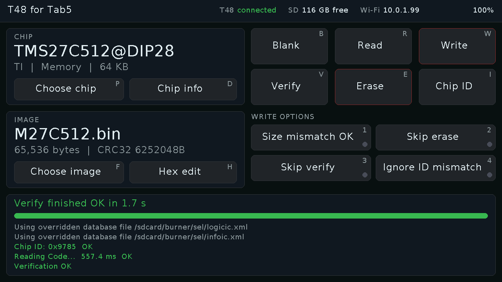
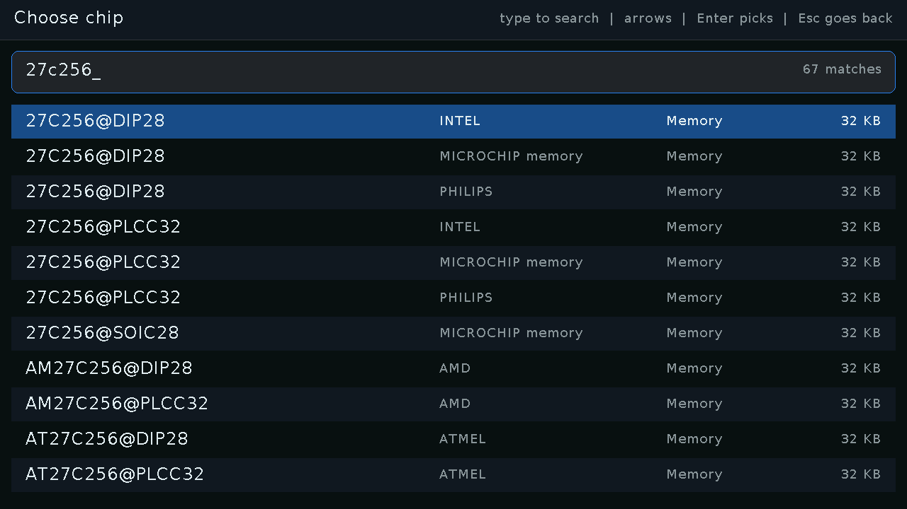
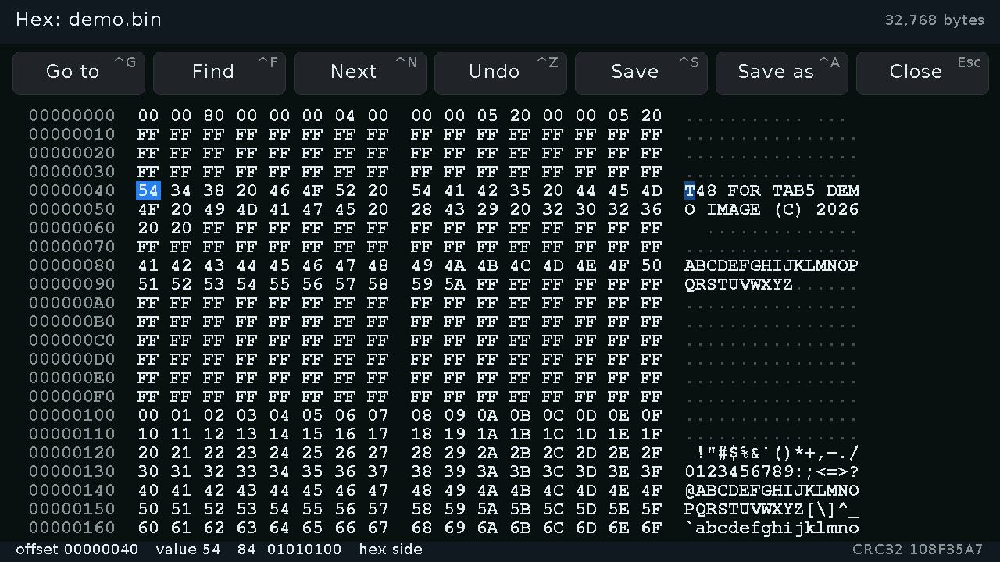

# T48 for Tab5

A stand-alone EPROM/flash programmer: an [M5Stack Tab5](https://docs.m5stack.com/en/core/Tab5)
with its clip-on keyboard drives an [XGecu T48](http://www.xgecu.com/) plugged
into the Tab5's USB-A port. Pick a chip, pick an image, and blank check, read,
write, verify or erase without a computer. ROM images live on the Tab5's SD
card and move on and off it through a file manager in your browser.

Programming is done by [minipro](https://gitlab.com/DavidGriffith/minipro),
compiled unchanged and running on the Tab5 itself; only its USB layer is
replaced, so it behaves exactly as it does on a desktop.

## What it does

- **Every T48 part minipro knows** (about 30,000 names): type part of a name,
  arrows and Enter to pick. Memory parts get blank check, read, write,
  verify, erase and chip ID; logic parts get minipro's logic test.
- **Write options** as toggles: size mismatch OK, skip erase, skip verify,
  ignore chip ID mismatch.
- **Hex editor** for the chosen image: 16 bytes a row with ASCII, type over
  bytes on either side, go to an address, find hex bytes or text, undo, save
  or save as; changed bytes are highlighted and the CRC32 is always shown.
- **Browser file manager** for the card: drag-and-drop upload, download,
  rename, folders, delete, and "Burn this" to make a file the image to write.
- **Wi-Fi setup with no computer:** with no network saved (or one it cannot
  join), the Tab5 opens an open `T48-for-Tab5-XXXX` hotspot whose captive
  portal pops up on a phone to pick a network and type its password. The
  Wi-Fi screen shows a QR code for it.
- Reads and writes run at the same speed as minipro on a Mac (a 27C512 writes
  in about 31 s; nearly all of that is the T48 programming).

## Hardware

- M5Stack Tab5 (ESP32-P4) and the M5Stack Tab5 Keyboard. Chip search needs
  the keyboard; everything else also works by touch.
- XGecu T48 in the Tab5's USB-A port. The port is the P4's high-speed USB 2.0
  PHY and its 5 V switch (MT9700) comfortably powers the T48.
- A microSD card formatted **FAT32** (the prebuilt ESP-IDF has exFAT off).

**Battery charging is paused during every job.** While the Tab5's battery
charges, the T48 only sees about 4.4 V; with charging paused it gets 5 V.
The same pause covers the T48's inrush when the port powers up, which once
browned the Tab5 out on a laptop port.

Tested with T48 firmware 00.1.03 and 00.1.39 (the one minipro expects).

## Building and flashing

[PlatformIO](https://platformio.org/) with the pioarduino platform (in
`platformio.ini`):

    git clone --recursive https://github.com/djb-rh/t48-for-tab5
    cd t48-for-tab5
    pio run -e app -t upload

The app occupies the first 6 MB of flash (`partitions_app.csv`).

## The SD card

Everything lives under `/burner` on the card:

    burner/db/      the part library
    burner/sel/     minipro's one-part database for the chosen chip
    burner/images/  ROM images: reads land here, writes come from here

Build the part library from minipro's database on a computer, then upload
the four files to `burner/db` with the browser file manager (or copy them to
the card) and restart the Tab5:

    python3 tools/mkparts.py third_party/minipro sd/burner/db

minipro normally parses its whole 19 MB XML database several times per
command. `mkparts.py` splits it into a sorted name index, the raw part
entries and the database skeleton; choosing a part writes a database holding
only that part, which minipro parses in milliseconds.

## Using it

Main screen keys (all are also buttons):

| Key | | Key | |
|---|---|---|---|
| P | choose chip | B | blank check |
| D | chip info | R | read (into `burner/images`) |
| F | choose image | W | write |
| H | hex editor | V | verify |
| N | Wi-Fi | E | erase |
| 1-4 | write options | I | chip ID (T: logic test) |

Write and erase ask first. A read becomes the current image.

Hex editor: arrows, PgUp/PgDn, Home/End, Ctrl+Home/End; hex digits (or text
on the ASCII side; Tab switches sides); Ctrl+G go to, Ctrl+F find (`C3 00 10`
or `"text"`), Ctrl+N next, Ctrl+Z undo, Ctrl+S save, Ctrl+A save as, Esc.

The file manager is at the address shown in the header once the Tab5 is on
Wi-Fi, and at `http://192.168.4.1/files` over the setup hotspot.

## Development

- `src/app` is the app, `src/core` the USB layer (`usb_esp.cpp`, the ESP32-P4
  host stack in place of minipro's libusb file) and minipro's `main()`
  renamed so it can be called with an argv. `src/spike` and `src/chiptest`
  are the bring-up steps (`pio run -e spike`, `-e chiptest`).
- `tools/tab5.py` drives one serial session (opening the port resets the
  Tab5): console commands, `--key=`, `--tap=`, `--shot=` screenshots,
  `--put=`/`--get=` files. `tools/monitor.py` only listens. The console's
  commands are listed at the top of `src/app/console.cpp`; every job prints
  where its time went over USB.

Lessons from getting here:

- **Internal RAM feeds the Wi-Fi.** The Tab5's radio is an ESP32-C6 behind
  esp_hosted, whose transport needs DMA-capable internal RAM. With minipro's
  48 KB stack and a few file buffers in internal RAM, one upload left 4 KB in
  one piece and the network died for good. They live in PSRAM now.
- **ESP-IDF logging is off.** With a computer attached but nothing reading
  the USB serial port, log writes from the Wi-Fi stack stalled it and uploads
  intermittently killed the network.
- **Nothing should draw inside minipro's output path.** An early build redrew
  the screen while holding a lock minipro's printing needed, which made reads
  2.5x and writes 30% slower than on a Mac.

## Licence

GPL-3.0-or-later (see [LICENSE](LICENSE)), because it includes minipro, which
is GPL-3.0-or-later. Copyright (C) 2026 Donald Barnes. minipro is copyright
its authors; see `third_party/minipro`.
