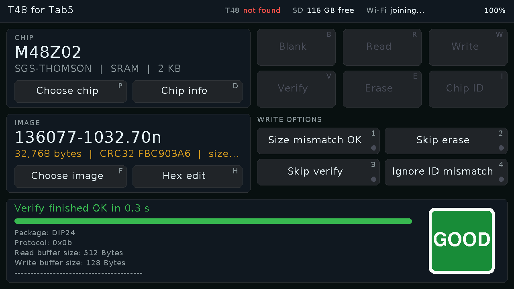
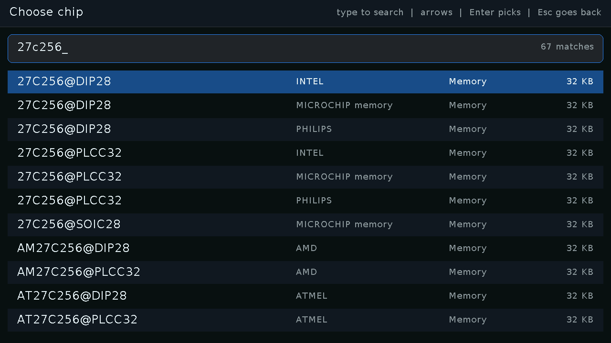
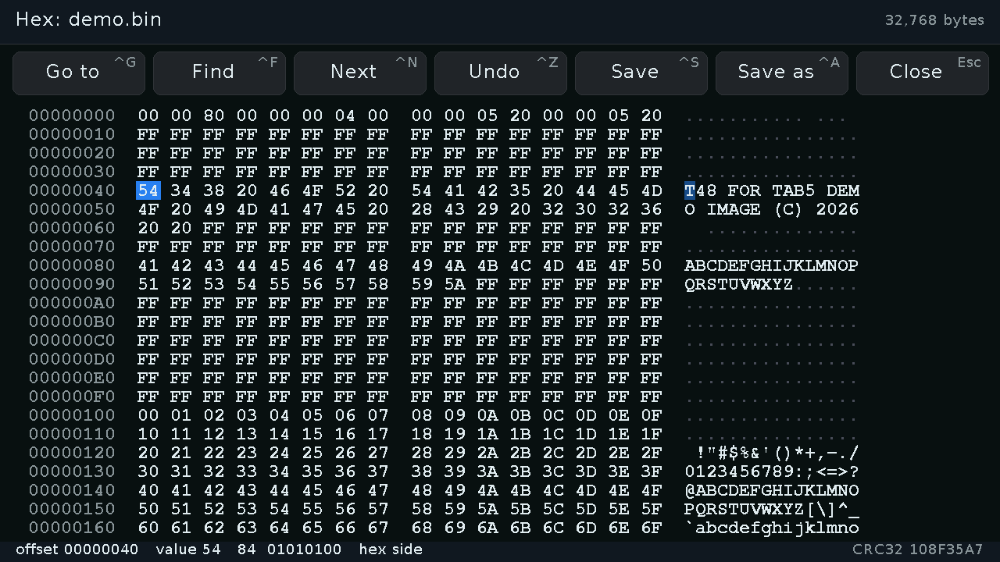

# T48 for Tab5

A stand-alone EPROM/flash programmer: an [M5Stack Tab5](https://docs.m5stack.com/en/core/Tab5)
with its clip-on keyboard drives an [XGecu T48](http://www.xgecu.com/) plugged
into the Tab5's USB-A port. Pick a chip, pick an image, and blank check, read,
write, verify or erase without a computer. ROM images live on the Tab5's SD
card and move on and off it through a file manager in your browser.

Programming is done by [minipro](https://gitlab.com/DavidGriffith/minipro),
compiled unchanged and running on the Tab5 itself; only its USB layer is
replaced, so it behaves exactly as it does on a desktop.

## What it does

- **Every T48 part minipro knows** (about 30,000 names): type part of a name,
  arrows and Enter to pick. Memory parts get blank check, read, write,
  verify, erase and chip ID; logic parts get minipro's logic test.
- **A sign you can read across the room** when a job ends: a red STOP sign
  if a blank check, read, write, verify, erase or chip ID fails, a green GOOD
  square if it passed.
- **Wrong chip in the socket?** When the chip ID doesn't match the part you
  chose, the ID is looked up in the whole library (parts programmed the same
  way, same package first) and you're offered the match. An ID of 0000 or
  FFFF means no chip answered: check its orientation and the lever.
- **Write options** as toggles: size mismatch OK, skip erase, skip verify,
  ignore chip ID mismatch.
- **Hex editor** for the chosen image: 16 bytes a row with ASCII, type over
  bytes on either side, go to an address, find hex bytes or text, undo, save
  or save as; changed bytes are highlighted and the CRC32 is always shown.
- **Browser file manager** for the card: drag-and-drop upload, download,
  rename, folders, delete, and "Burn this" to make a file the image to write.
- **Zip files unpack themselves:** an uploaded `.zip` is extracted into a
  folder of the same name (a single top folder inside it and macOS
  `__MACOSX` clutter are dropped) and removed; on the Tab5, choosing a `.zip`
  in the image picker offers to extract it. Stored and deflate, CRC-checked.
- **README viewer:** a `README.md` (or `.txt`) in a folder opens in a reader
  from the image picker (M, or pick the file); Markdown gets headings, lists
  and code blocks, plain text a monospaced font so column tables line up.
  The browser shows them with a View button.
- **Wi-Fi setup with no computer:** with no network saved (or one it cannot
  join), the Tab5 opens an open `T48-for-Tab5-XXXX` hotspot whose captive
  portal pops up on a phone to pick a network and type its password. The
  Wi-Fi screen shows a QR code for it.
- Reads and writes run at the same speed as minipro on a Mac (a 27C512 writes
  in about 31 s; nearly all of that is the T48 programming).

## Hardware

- M5Stack Tab5 (ESP32-P4) and the M5Stack Tab5 Keyboard. Chip search needs
  the keyboard; everything else also works by touch.
- XGecu T48 in the Tab5's USB-A port. The port is the P4's high-speed USB 2.0
  PHY and its 5 V switch (MT9700) comfortably powers the T48.
- A microSD card formatted **FAT32** (the prebuilt ESP-IDF has exFAT off).

**Battery charging is paused during every job.** While the Tab5's battery
charges, the T48 only sees about 4.4 V; with charging paused it gets 5 V.
The same pause covers the T48's inrush when the port powers up, which once
browned the Tab5 out on a laptop port.

Tested with T48 firmware 00.1.03 and 00.1.39 (the one minipro expects).

## Installing without building anything

Open the **[web installer](https://djb-rh.github.io/t48-for-tab5/)** in Chrome
or Edge on a desktop, connect the Tab5's USB-C port and click Install. Then
unzip `t48-for-tab5-sdcard-<version>.zip` from the
[latest release](https://github.com/djb-rh/t48-for-tab5/releases/latest) onto a
FAT32 microSD card. The release also has the merged firmware image
(`t48-for-tab5-<version>.bin`, written at offset 0) for esptool or any other
flasher.

## Building and flashing

[PlatformIO](https://platformio.org/) with the pioarduino platform (in
`platformio.ini`):

    git clone --recursive https://github.com/djb-rh/t48-for-tab5
    cd t48-for-tab5
    pio run -e app -t upload

The app occupies the first 6 MB of flash (`partitions_app.csv`).

## The SD card

Everything lives under `/burner` on the card:

    burner/db/      the part library
    burner/sel/     minipro's one-part database for the chosen chip
    burner/images/  ROM images: reads land here, writes come from here

Build the part library from minipro's database on a computer, then upload
the four files to `burner/db` with the browser file manager (or copy them to
the card) and restart the Tab5:

    python3 tools/mkparts.py third_party/minipro sd/burner/db

minipro normally parses its whole 19 MB XML database several times per
command. `mkparts.py` splits it into a sorted name index, the raw part
entries and the database skeleton; choosing a part writes a database holding
only that part, which minipro parses in milliseconds.

## Using it

Main screen keys (all are also buttons):

| Key | | Key | |
|---|---|---|---|
| P | choose chip | B | blank check |
| D | chip info | R | read (into `burner/images`) |
| F | choose image | W | write |
| H | hex editor | V | verify |
| N | Wi-Fi | E | erase |
| 1-4 | write options | I | chip ID (T: logic test) |

Write and erase ask first. A read becomes the current image.

Image picker: Enter picks an image (or opens a folder, a README, or offers to
extract a zip), M opens the folder's README, Del deletes, Esc goes back.

Hex editor: arrows, PgUp/PgDn, Home/End, Ctrl+Home/End; hex digits (or text
on the ASCII side; Tab switches sides); Ctrl+G go to, Ctrl+F find (`C3 00 10`
or `"text"`), Ctrl+N next, Ctrl+Z undo, Ctrl+S save, Ctrl+A save as, Esc.

The file manager is at the address shown in the header once the Tab5 is on
Wi-Fi, and at `http://192.168.4.1/files` over the setup hotspot.

## Development

- `src/app` is the app, `src/core` the USB layer (`usb_esp.cpp`, the ESP32-P4
  host stack in place of minipro's libusb file) and minipro's `main()`
  renamed so it can be called with an argv. `src/spike` and `src/chiptest`
  are the bring-up steps (`pio run -e spike`, `-e chiptest`).
- `tools/release.sh <version>` builds the release files into `dist/` and the
  web installer into `site/`, which is what the `gh-pages` branch serves.
- `tools/tab5.py` drives one serial session (opening the port resets the
  Tab5): console commands, `--key=`, `--tap=`, `--shot=` screenshots,
  `--put=`/`--get=` files. `tools/monitor.py` only listens. The console's
  commands are listed at the top of `src/app/console.cpp`; every job prints
  where its time went over USB.

Lessons from getting here:

- **Internal RAM feeds the Wi-Fi.** The Tab5's radio is an ESP32-C6 behind
  esp_hosted, whose transport needs DMA-capable internal RAM. With minipro's
  48 KB stack and a few file buffers in internal RAM, one upload left 4 KB in
  one piece and the network died for good. They live in PSRAM now.
- **Update the Wi-Fi chip.** The Tab5's C6 shipped with esp-hosted 1.4.1
  while this build's host side is 2.12.13 (v1.2; v1.1 was 2.12.11); the Wi-Fi screen shows both and
  offers "Update Wi-Fi chip" (downloaded from Espressif) when they differ.
- **The C6 link can still wedge** (after a Wi-Fi scan most often, sometimes on
  the first big upload after boot), a known esp-hosted problem on P4 + C6
  boards (espressif/esp-hosted-mcu#184). The station still reports
  "connected", so the firmware pings the router every 10 s and, after 30 s of
  silence, restarts when idle on the main screen (rejoining never helped).
  `/api/wifistate` shows the counters.
- **Uploads go in 16 KB pieces** (`PUT /api/put?path=&offset=&total=`), each
  appended to a `.part` file: one long inbound stream is what wedges the link.
  About 220 KB/s from a browser, which keeps the connection open.
- **minipro's `exit()`** would restart the board (ESP-IDF aborts); it
  `longjmp`s back to the caller instead, which is what makes Chip info work.
- **ESP-IDF logging is off.** With a computer attached but nothing reading
  the USB serial port, log writes from the Wi-Fi stack stalled it and uploads
  intermittently killed the network.
- **Nothing should draw inside minipro's output path.** An early build redrew
  the screen while holding a lock minipro's printing needed, which made reads
  2.5x and writes 30% slower than on a Mac.

## Licence

GPL-3.0-or-later (see [LICENSE](LICENSE)), because it includes minipro, which
is GPL-3.0-or-later. Copyright (C) 2026 Donald Barnes. minipro is copyright
its authors; see `third_party/minipro`.
